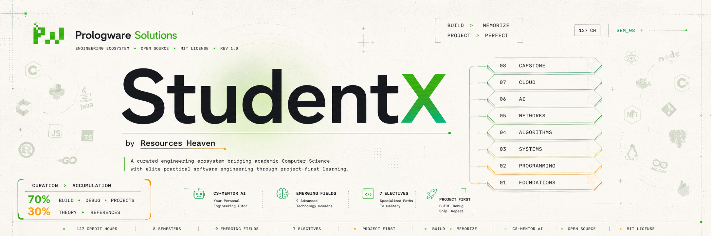

# Studentx: Engineering Mastery Ecosystem

**Studentx** is a comprehensive, curated repository designed for absolute beginners and ambitious learners to master Computer Science and Cybersecurity. 

This project bridges the gap between traditional academic theory and elite practical engineering, providing a structured yet flexible environment to build mastery.

---

## 🚀 How to Utilize This Ecosystem

Studentx is organized into two primary pillars: a **Portable Knowledge Base** and an **Interactive AI Mentor**.

### 1. The Knowledge Base (The Blueprint)
The core of your journey lies in these folders:
*   **`semesters/`**: A structured 8-semester curriculum. Each semester includes:
    *   **Courses:** Detailed overview, learning objectives, detailed module topics, recommended books, online resources, video channels (English & Hindi/Urdu), software tools, lab work, and assessment methods.
*   **`guides/`**: Specialized manuals for:
    *   **Study Techniques:** Effective learning (Active Recall, Spaced Repetition).
    *   **Career Preparation:** Resume building, LinkedIn optimization, interview prep.
    *   **Self-Learning Framework:** The Autodidact’s Manifesto for mastering CS.
    *   **Emerging Fields & Electives:** Explore cutting-edge areas outside the core curriculum.
*   **`prompts/`**: A collection of high-quality system prompts to guide your AI assistant/agent through specific learning tasks.

### 2. The Interactive Mentor (The Engine)
If you are using Gemini CLI, you can activate the **CS-Mentor** skill for an advanced, self-improving AI tutor.

*   **Activate:** `activate_skill cs-mentor`
*   **Command Guide (`/cs-mentor/GUIDE.md`):**
    *   `/mentor-path`: Interactive, one-question-at-a-time guidance.
    *   `/search-knowledge <term>`: Search the entire curriculum (semesters/guides) for a topic.
    *   `/deep-dive <topic>`: Comprehensive exploration of complex concepts.
    *   `/project-audit`: Critique your project ideas and receive architectural guidance.

---

## 🧭 Project Roadmap Navigation

| Goal | Path |
| :--- | :--- |
| **Academic Path** | [Academic Course Map](courses_scheme_map.md) |
| **Self-Taught Path** | [The Autodidact’s Manifesto](guides/self-learning.md) |
| **Cybersecurity** | [Cybersecurity Roadmap](cs-mentor/references/cybersecurity.md) |
| **Structured Study** | [Semester Breakdown](semesters/) |
| **Career & Growth** | [Career Preparation Guide](guides/career-preparation.md) |

---

## 💡 The Philosophy: "Curation over Accumulation"
**Stop drowning in information.**
We follow the **70/30 Rule**: Spend **70% of your time building/debugging** and **30% consuming theory**. Use the **CS-Mentor** or any AI agent to help you *apply* what you read, not just to consume more.

---

### Attribution
This project is a proud initiative of the **Prologware Solutions Community**, brought to you by **Resources Heaven**. 

*Maintained by Abdul Basit Memon (ABM).*
